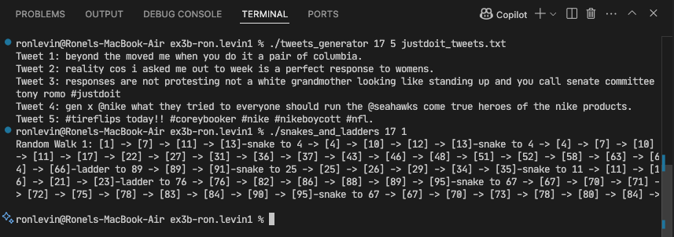
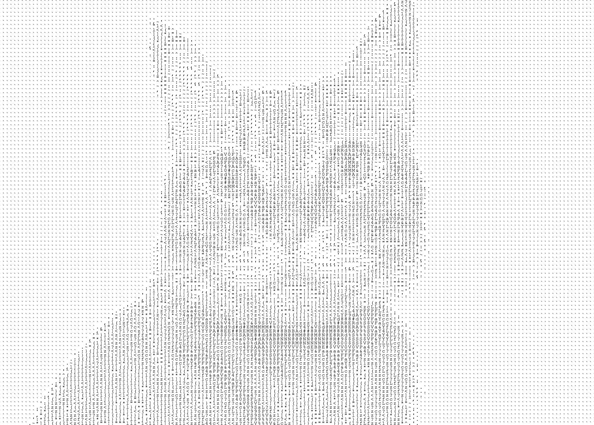
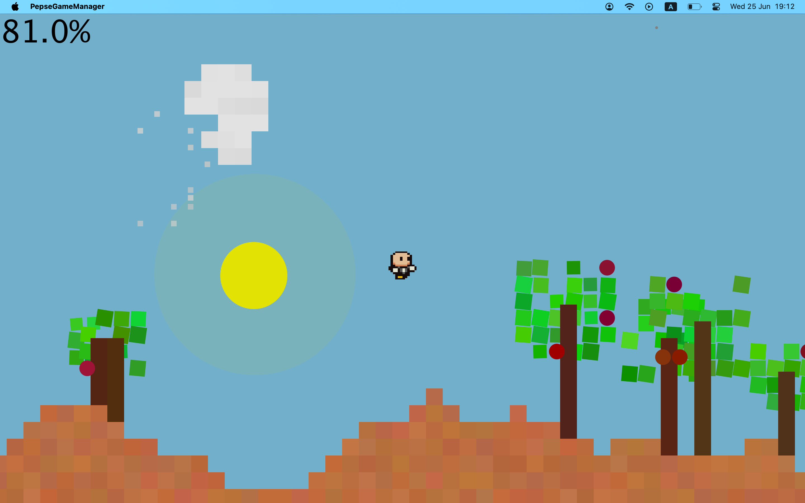

# Hi there, I'm Ron! 👋

## About Me

I'm a 3rd year Computer Science student, looking for a part-time Software Engineering role.
I value a hardworking approach and have built a diverse background through rigorous academic, military, and volunteer experiences. This path developed my commitment to excellence and teamwork. I appreciate personal growth, work steadily under pressure, and look for ways to contribute positively anywhere I am.
 
I am fascinated by Mathematics and Theoretical CS. I'm particularly interested in projects that merge theoretical concepts with practical applications and hands-on coding.

- 🌱 Currently learning: **Operating Systems, Computability & Complexity**
- 🌍 Languages: **Python, C/C++, Java**
- 📫 How to reach me: **ronlvn@gmail.com**

## My Skills 🧠

## Featured Projects 💻

### Project 1

**Image Editing System**  
A command-line image processing tool that allows applying various filters and adjustments to images through configuration files, built in Python.  
This project showcases my skills in **Object-Oriented-Programming**. You can check out the repository 

### Project 2

**Generic Markov Chain**  
This project provides a generic implementation of a Markov chain in C and demonstrates its application through two different programs: a "Snakes and Ladders" game simulator and a text-based tweet generator.
You can check out the repository   

*Demo run Screenshot:*  

### Project 3

**ASCII Art**  
A Java-based application that converts images into ASCII art.  
You can check out the repository 

*Demo run Screenshot:*  

### Project 4

**PEPSE - A 2D Platformer Game**  
Environmental Procedural Simulator, Super-Mario-like-style built in Java.  
This project showcases my skills in **Object-Oriented-Programming**. You can check out the repository .

*Demo run Screenshot:*  

